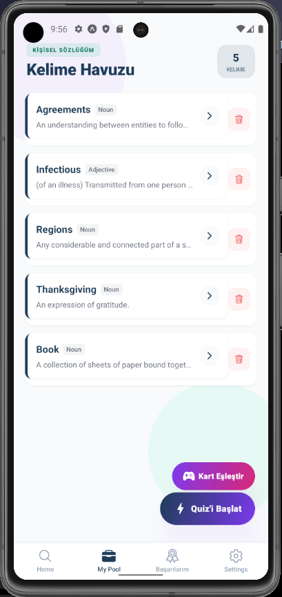
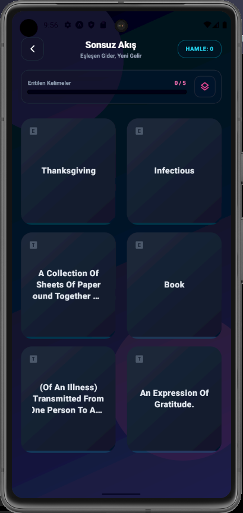
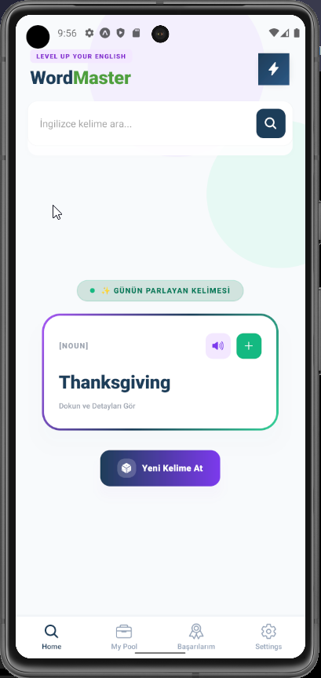
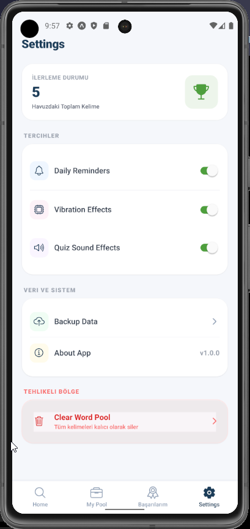
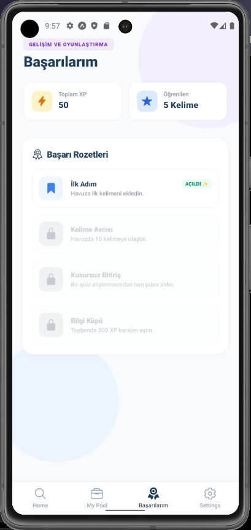
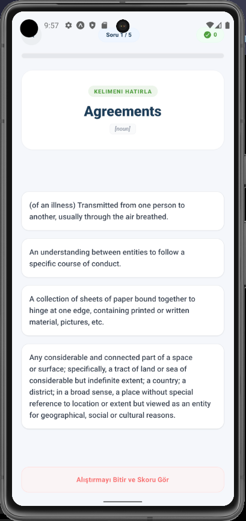

# 🎮 Word Master

Word Master, geleneksel sözlük mantığını modern oyunlaştırma (**gamification**) elementleriyle birleştiren, kullanıcıyı dinamik bir öğrenme sürecinde tutmak amacıyla tasarlanmış, siber punk esintili bir mobil dil öğrenme uygulamasıdır.

Kullanıcıların kendi kelime havuzlarını oluşturmalarına, dinamik bir matris arayüzünde kelimeleri eşleştirmelerine ve bunu yaparken deneyim puanı (**XP**) kazanarak ilerlemelerini takip etmelerine olanak tanır.

---

## 📸 Ekran Görüntüleri & Demo

### 1. Kelime Havuzu & Arayüz

<p align="center">
  
</p>

### 2. Kelime Arenası (Başlangıç)

<p align="center">
  
</p>

### 3. Ana Sayfa

<p align="center">
  
</p>

### 4. Ayarlar

<p align="center">
  
</p>

### 5. Başarılarım

<p align="center">
  
</p>

### 6. Quiz

<p align="center">
  
</p>


### 🎬 Canlı Uygulama Demosu


---

## 🚀 Öne Çıkan Özellikler

* **Sonsuz Akış Eşleştirme Motoru:** 2 sütun x 3 satır formatında 6 büyük karttan oluşan dinamik oyun alanı. Eşleşen kartlar havuzdan pürüzsüzce silinir ve yerlerine asenkron olarak kuyruktaki yeni kelimeler gelir.
* **Akıllı Metin Guard Sistemi (Dynamic Size Guard):** Uzun kelimelerin kart sınırlarından taşmasını önlemek amacıyla karakter uzunluğunu analiz eden ve yazı boyutunu dinamik olarak küçülten (`numberOfLines={3}`) akıllı arayüz yapısı.
* **Arcade Tasarım Dili:** Cyberpunk esintili koyu gece mavisi (`#0f172a`) zemin, dillerine göre mor ve turkuaz ayrışımlı neon gradyanlar ve basılma hissi uyandıran kalın alt kenarlıklı (`border-b-4`) 3D kart tasarımları.
* **Renk Tabanlı Reaktif Geri Bildirim:** Doğru eşleşmelerde anında parlayan **Zümrüt Yeşili** (`#10b981`) `fade-out` efekti; hatalı seçimlerde ise kullanıcıyı uyaran kırmızı kalma mekanizması.
* **Performanslı State Yönetimi:** Hafif ve performans odaklı **Zustand** mimarisi sayesinde uygulama genelinde akıcı XP ve ilerleme barı takibi.

---

## 🛠️ Kullanılan Teknolojiler ve Araçlar

* **Framework & Runtime:** React Native & Expo Router (Cross-Platform)
* **UI & Stil Yönetimi:** NativeWind CSS (Tailwind) & Expo LinearGradient
* **Durum Yönetimi (State):** Zustand
* **Animasyonlar:** React Native `Animated` API (`Animated.parallel` & `Animated.timing`)
* **Tip Güvenliği:** TypeScript (`as const` ile LinearGradient veri koruması)

---

## 📦 Kurulum ve Çalıştırma

### 1. Depoyu Klonlayın

```bash
git clone https://github.com/ruveydakisla/kelime-arenasi-react-native.git
cd kelime-arenasi-react-native
```

### 2. Bağımlılıkları Yükleyin

```bash
npm install
# veya
yarn install
```

### 3. Uygulamayı Başlatın (Expo CLI)

```bash
npx expo start
```

### Çalıştırma Seçenekleri

- QR kodu kameranızla taratarak Expo Go uygulaması üzerinden fiziksel cihazınızda test edebilirsiniz.
- `a` tuşuna basarak Android Emulator, `i` tuşuna basarak iOS Simulator üzerinde ayağa kaldırabilirsiniz.

---

## 📂 Klasör Yapısı

```plaintext
├── app/
│   ├── _layout.tsx
│   ├── index.tsx
│   └── match-game.tsx
├── utils/
│   └── store.ts
├── screenshots/
├── package.json
└── tailwind.config.js
```

---

## 🔮 Gelecek Planları (Roadmap)

- [ ] Canlı Skor Tablosu (Leaderboard)
- [ ] Yapay zeka destekli Spaced Repetition sistemi
- [ ] Text-to-Speech ve cümle içi kullanım modülleri

---

## 📄 Lisans

Bu proje, Mobil Uygulama Geliştirme dersi kapsamında akademik amaçlarla geliştirilmiş olup tüm hakları Ruveyda Kışla'ya aittir.
